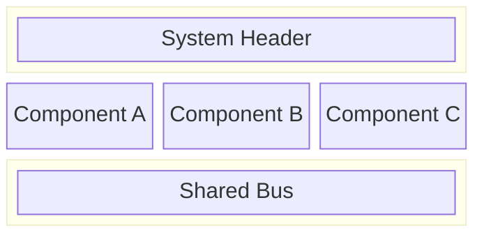

# Block Diagram Layout

```mermaid
block-beta
    columns 3
    block:header:3
        h["System Header"]
    end
    b1["Component A"]
    b2["Component B"]
    b3["Component C"]
    block:footer:3
        f["Shared Bus"]
    end
```
