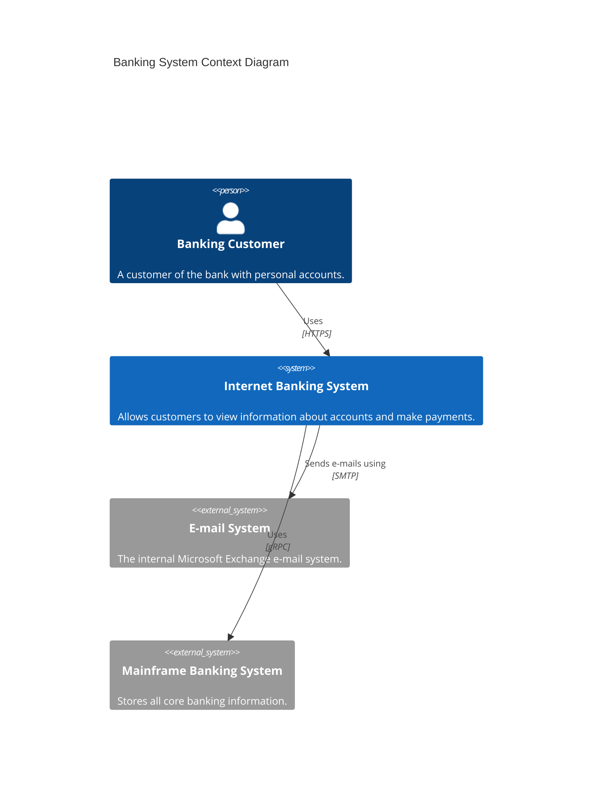

# C4 Context Diagram

```mermaid
C4Context
    title Banking System Context Diagram
    Person(customer, "Banking Customer", "A customer of the bank with personal accounts.")
    System(bankingSystem, "Internet Banking System", "Allows customers to view information about accounts and make payments.")
    System_Ext(mailSystem, "E-mail System", "The internal Microsoft Exchange e-mail system.")
    System_Ext(mainframe, "Mainframe Banking System", "Stores all core banking information.")

    Rel(customer, bankingSystem, "Uses", "HTTPS")
    Rel(bankingSystem, mailSystem, "Sends e-mails using", "SMTP")
    Rel(bankingSystem, mainframe, "Uses", "gRPC")
```
