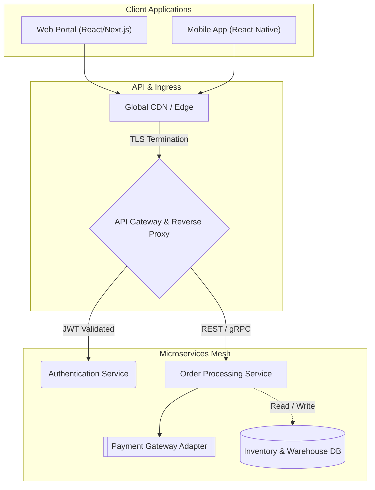

# Flowchart with Subgraphs and Node Shapes

```mermaid
flowchart TB
    subgraph ClientLayer["Client Applications"]
        Web["Web Portal (React/Next.js)"]
        Mobile["Mobile App (React Native)"]
    end

    subgraph GatewayLayer["API & Ingress"]
        CDN["Global CDN / Edge"]
        APIGW{"API Gateway & Reverse Proxy"}
    end

    subgraph ServiceMesh["Microservices Mesh"]
        AuthSvc("Authentication Service")
        OrderSvc["Order Processing Service"]
        PaymentSvc[["Payment Gateway Adapter"]]
        InventorySvc[("Inventory & Warehouse DB")]
    end

    Web --> CDN
    Mobile --> CDN
    CDN -->|TLS Termination| APIGW
    APIGW -->|JWT Validated| AuthSvc
    APIGW -->|REST / gRPC| OrderSvc
    OrderSvc --> PaymentSvc
    OrderSvc -.->|Read / Write| InventorySvc
```
