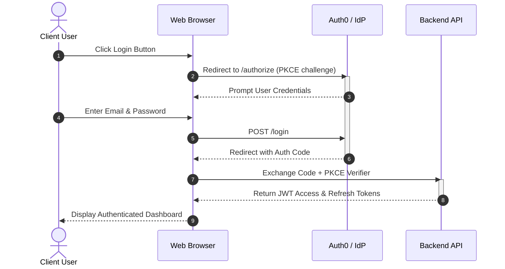

# Sequence Authentication Flow

```mermaid
sequenceDiagram
    autonumber
    actor User as Client User
    participant Browser as Web Browser
    participant Auth as Auth0 / IdP
    participant API as Backend API

    User->>Browser: Click Login Button
    Browser->>Auth: Redirect to /authorize (PKCE challenge)
    activate Auth
    Auth-->>Browser: Prompt User Credentials
    User->>Browser: Enter Email & Password
    Browser->>Auth: POST /login
    Auth-->>Browser: Redirect with Auth Code
    deactivate Auth
    Browser->>API: Exchange Code + PKCE Verifier
    activate API
    API-->>Browser: Return JWT Access & Refresh Tokens
    deactivate API
    Browser-->>User: Display Authenticated Dashboard
```
