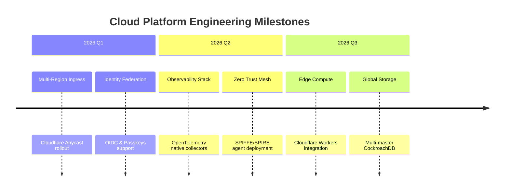

# Release Timeline

```mermaid
timeline
    title Cloud Platform Engineering Milestones
    section 2026 Q1
      Multi-Region Ingress : Cloudflare Anycast rollout
      Identity Federation : OIDC & Passkeys support
    section 2026 Q2
      Observability Stack : OpenTelemetry native collectors
      Zero Trust Mesh : SPIFFE/SPIRE agent deployment
    section 2026 Q3
      Edge Compute : Cloudflare Workers integration
      Global Storage : Multi-master CockroachDB
```
