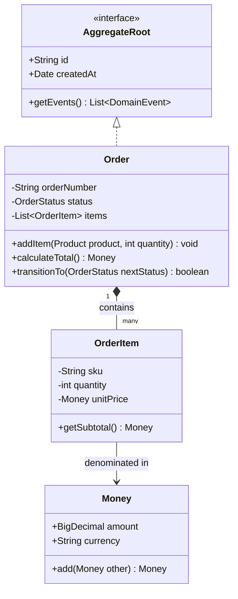

# Class Domain Model

```mermaid
classDiagram
    class AggregateRoot {
        <<interface>>
        +String id
        +Date createdAt
        +getEvents() List~DomainEvent~
    }

    class Order {
        -String orderNumber
        -OrderStatus status
        -List~OrderItem~ items
        +addItem(Product product, int quantity) void
        +calculateTotal() Money
        +transitionTo(OrderStatus nextStatus) boolean
    }

    class OrderItem {
        -String sku
        -int quantity
        -Money unitPrice
        +getSubtotal() Money
    }

    class Money {
        +BigDecimal amount
        +String currency
        +add(Money other) Money
    }

    AggregateRoot <|.. Order
    Order "1" *-- "many" OrderItem : contains
    OrderItem --> Money : denominated in
```
