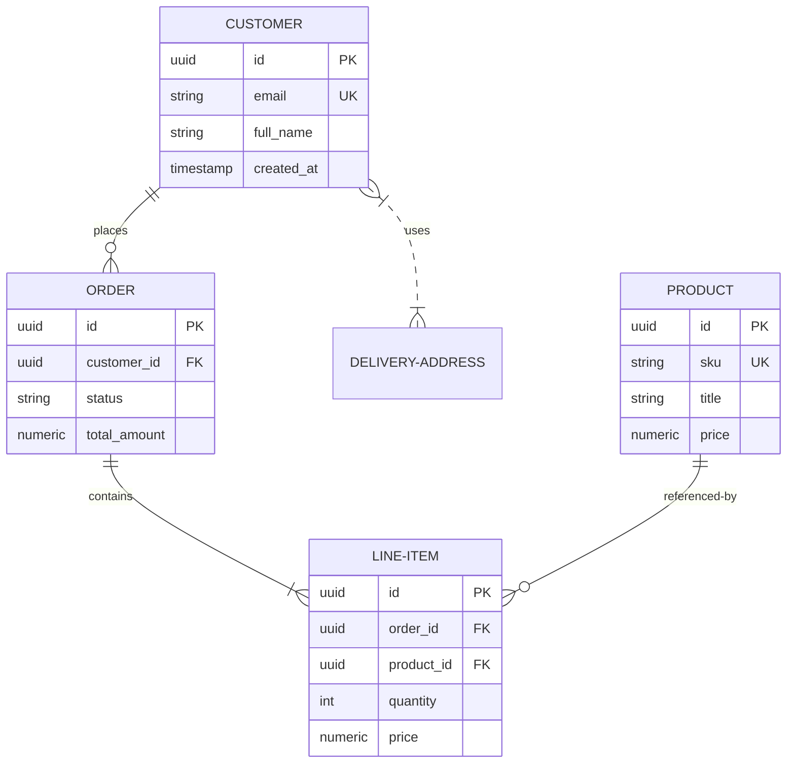

# Entity-Relationship Schema

```mermaid
erDiagram
    CUSTOMER ||--o{ ORDER : places
    ORDER ||--|{ LINE-ITEM : contains
    CUSTOMER }|..|{ DELIVERY-ADDRESS : uses
    PRODUCT ||--o{ LINE-ITEM : referenced-by

    CUSTOMER {
        uuid id PK
        string email UK
        string full_name
        timestamp created_at
    }

    ORDER {
        uuid id PK
        uuid customer_id FK
        string status
        numeric total_amount
    }

    LINE-ITEM {
        uuid id PK
        uuid order_id FK
        uuid product_id FK
        int quantity
        numeric price
    }

    PRODUCT {
        uuid id PK
        string sku UK
        string title
        numeric price
    }
```
