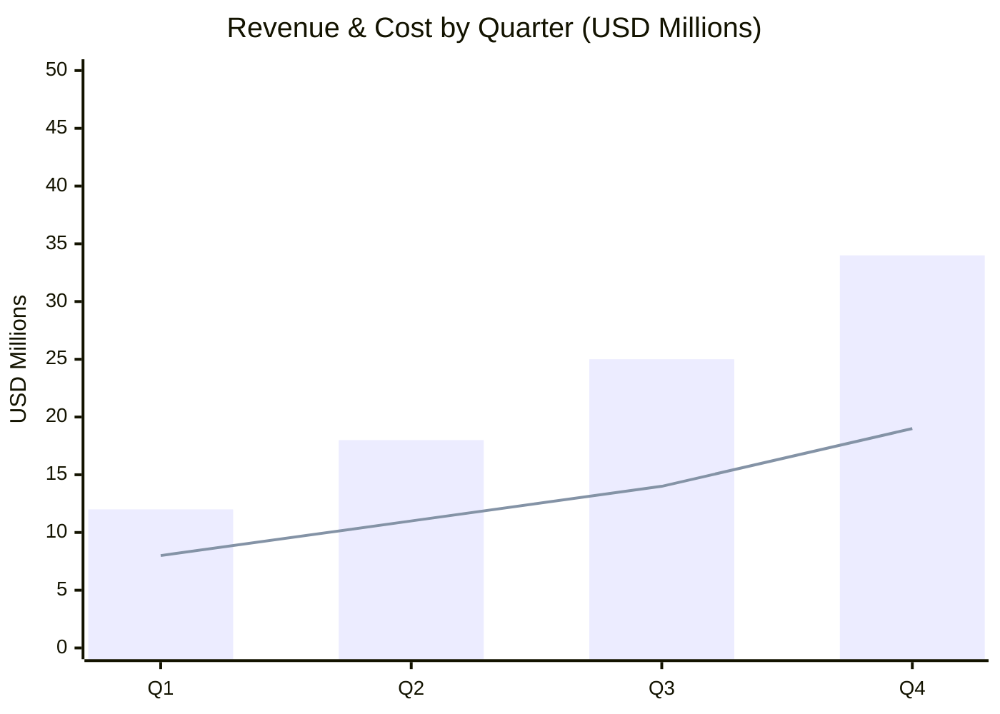

# Quarterly Revenue Comparison

```mermaid
xychart-beta
    title "Revenue & Cost by Quarter (USD Millions)"
    x-axis ["Q1", "Q2", "Q3", "Q4"]
    y-axis "USD Millions" 0 --> 50
    bar [12, 18, 25, 34]
    line [8, 11, 14, 19]
```
