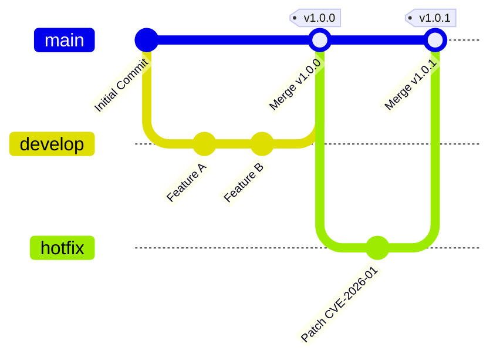

# Git Branching Strategy

```mermaid
gitGraph
    commit id: "Initial Commit"
    branch develop
    checkout develop
    commit id: "Feature A"
    commit id: "Feature B"
    checkout main
    merge develop id: "Merge v1.0.0" tag: "v1.0.0"
    branch hotfix
    checkout hotfix
    commit id: "Patch CVE-2026-01"
    checkout main
    merge hotfix id: "Merge v1.0.1" tag: "v1.0.1"
```
