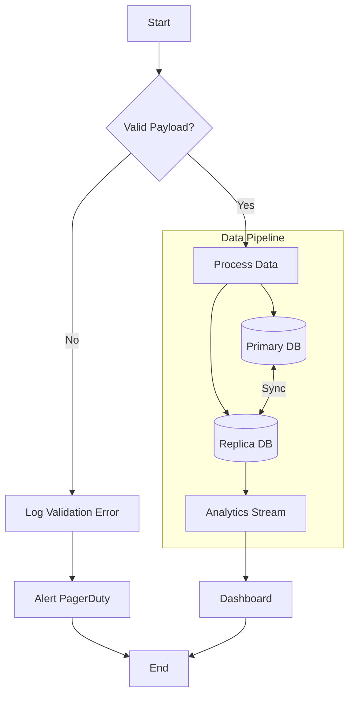

# Complex Nested Graph with Bi-directional and Labeled Edges

```mermaid
flowchart TD
    A[Start] --> B{Valid Payload?}
    B -- Yes --> C[Process Data]
    B -- No --> D[Log Validation Error]
    
    subgraph DataPipeline["Data Pipeline"]
        C --> E[(Primary DB)]
        C --> F[(Replica DB)]
        E <-->|Sync| F
        F --> G[Analytics Stream]
    end

    D --> H[Alert PagerDuty]
    G --> I[Dashboard]
    H --> J[End]
    I --> J
```
