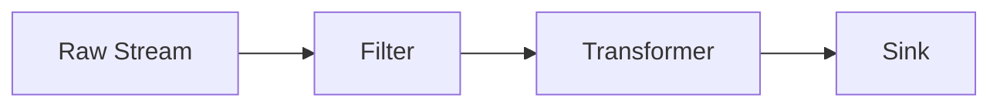

# ASCII-Only Terminal Mode

When generating `llms.txt` or plain-text markdown feeds, visual SVGs can be replaced with Unicode/ASCII box-drawing characters:

```mermaid
graph LR
  Input[Raw Stream] --> Filter[Filter]
  Filter --> Transform[Transformer]
  Transform --> Output[Sink]
```
